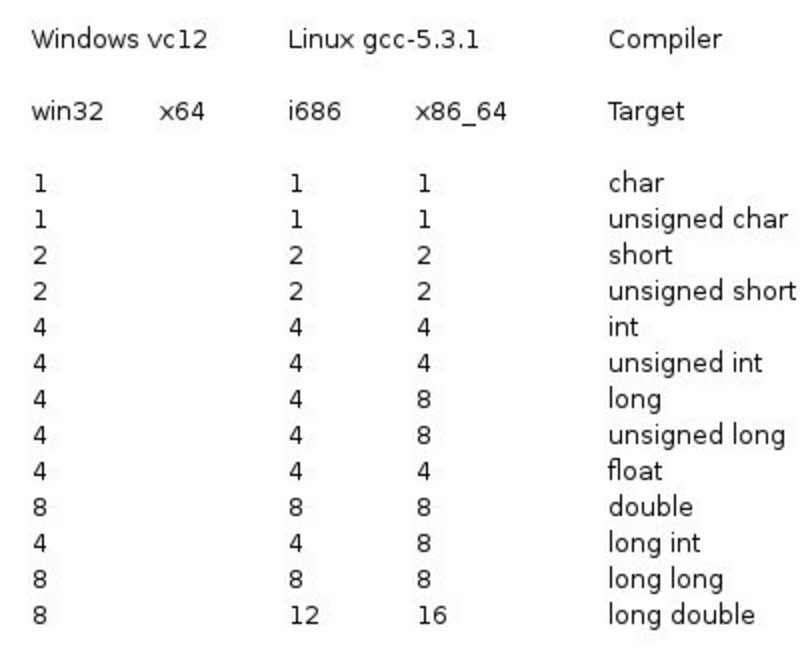

## C 数据类型
在c语言中，数据类型指的是用于声明不同类型的变量或函数的一个广泛的系统。变量的类型决定了变量存储占用的空间，以及如何解释存储的位模式。
C 中的类型可以分为以下几种：

|序号|类型与描述|
|----|----|
|1|**基本类型：**它们是算术类型，包括两种类型：证书类型和浮点类型。|
|2|**枚举类型：**它们也是算术类型，被用来定义在程序中只能赋予其一定的离散整数值得变量。|
|3|**void类型：**类型说明符 void 表明没有可用的值。|
|4|**派生类型：**它们包括：指针类型、数组类型、结构类型、共用体类型和函数类型。|

数组类型和结构类型统称为聚合类型。函数的类型指的是函数返回值的类型。

先学基本类型，其他的以后再学。

---

## 整数类型
下表列出了关于标准整数类型的存储大小和值范围的细节：

|类型|存储大小|值范围|
|:----:|:----:|:----:|
|char|1字节|-128 到 127 或 0 到 255|
|unsigned char|1字节|0 到 255|
|signed char|1字节|-128 到 127|
|int|2或4字节|-32,768 到 32,767 或 -2,147,483,648 到 2,147,483,647|
|unsigned int|2或4字节|0 到 65,535 或 0 到 4,294,967,295|
|short|2字节|-32,768 到 32,767|
|unsigned short|2字节|0 到 65,535|
|long|4字节|-2,147,483,648 到 2,147,483,647|
|unsigned long|4字节|0 到 4,294,967,295|

注意：各类型的存储大小与系统位数有关，但目前通用的以64位系统为主。
以下累出32位系统与64位系统的存储大小的差别（windows相同）

为了得到某个类型或某个变量在特定平台上的准确大小，您可以使用sizeof运算符。表达式sizeof（type）得到对象或类型的存储字节大小。下面实例演示获取int类型的大小：

```c
#include <stdio.h>
#include <limitd.h>

int main()
{
	printf("int 存储大小 ：%lu \n", sizeof(int));

	return 0;
}
```

%lu为32位无符号整数，（函数printf再叙）
当您在linux上编译并执行上面的程序时，他会产生下列结果：
`int 存储大小：4`

---

## 浮点类型
下表列出了关于标准浮点类型的存储大小、取值范围和精度的细节：

|类型|存储大小|值范围|精度|
|:----:|:----:|:----:|:----:|
|float|4字节|1.2E-38 到 3.4E+38|6位小数|
|double|8字节|2.3E-308 到 1.7E+308|15位小数|
|long double|16字节|3.4E-4932 到 1.1E+4932|19位小数|

头文件float.h定义了宏，在程序中可以使用这些值和其他有关实数二进制表示的细节。下面的示例将输出浮点类型占用的存储空间以及它的范围值：

```c
#include <stdio.h>
#include <float.h>

int main()
{
   printf("float 存储最大字节数 : %lu \n", sizeof(float));
   printf("float 最小值: %E\n", FLT_MIN );
   printf("float 最大值: %E\n", FLT_MAX );
   printf("精度值: %d\n", FLT_DIG );
   
   return 0;
}
```
%E 为以指数形式输出单、双精度实数（函数printf再叙）
当你在linux上编译并执行上面程序时，他会产生下列结果：

```
float 存储最大字节数 : 4 
float 最小值: 1.175494E-38
float 最大值: 3.402823E+38
精度值: 6
```
---

## void 类型
void类型指定没有可用的值。它通常用于以下三种情况下：

|序号|类型与描述|
|:----:|:----|
|1|**函数返回为空**C中有各种函数都不返回值，或者您可以说它们返回空。不返回值得函数的返回类型为空。例如：**void exit(int status);**|
|2|**函数参数为空**C中有各种函数不接受任何参数。不带参数的函数可以接受一个void。例如：**int rand(void);**|
|3|**指针指向void**类型为`void *`的指针代表对象地址，而不是类型。例如，内存分配函数`void *malloc(size_t size );`返回指向 void 的指针，可以转换为任何数据类型。|

无法理解，没关系。
苦心人，天不负。


