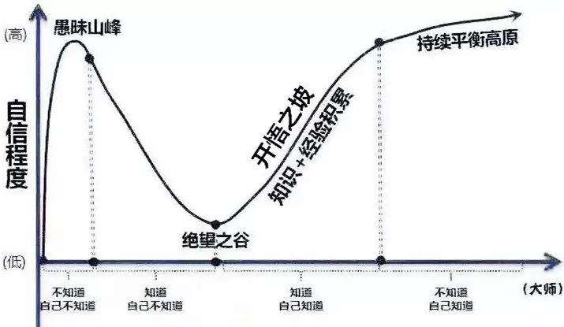

# 如果你已经25岁了，请一定要知道这些人情世故。

## 让你成熟至少5-8岁的8句话
- 如果不喜欢现在的工作，要么辞职不干，要么闭嘴不言。
- 学会忍受孤独。
- 不要像玻璃那样脆弱，做个内心强大的人。
- 管住自己的嘴巴。
- 学会创造机会。
- 若电话老是不响，你该打出去。
- 不要草率结婚。
- 写出你一生要做的事情，把单子放在皮夹里，经常拿出来看。

## 成功者的习惯
- 微笑。
- 气质纯朴。
- 不向朋友借钱。
- 背后说别人好话。
- 听到某人说别人坏话时只微笑。
- 过去的事不要然人全知道。
- 尊敬不喜欢你的人。
- 对事无情，对人有情。
- 多做自我批评。
- 为别人喝彩。
- 感恩。
- 学会聆听。
- 说话时经常用我们。
- 少说话。
- 喜欢自己。

## 建立人脉的15个提示
- 学会换位思考。
- 学会适应环境。
- 学会大方。
- 学会低调。
- 嘴要甜。
- 有礼貌。
- 言多必失。
- 学会感恩。
- 遵守时间。
- 信守诺言。
- 学会忍耐。
- 有一颗平常心。
- 待上以敬，待下以宽。
- 经常检讨自己。

## 年轻的我们必须懂得
- 你不勇敢，没人替你坚强。
- 没有伞的孩子必须努力奔跑。
- 自己选择的路，跪着也要把它走完。
- 不要生气要争气，不要看破要突破，不要嫉妒要欣赏，不要拖延要积极，不要心动要行动。
- 宁愿跑起来被绊倒无数次，也不愿规规矩矩走一辈子。就算跌倒也要豪迈的笑。

## 人脉中需要有的十种职业
- 票贩子
- 旅行社
- 律师
- 人才市场、猎头公司、银行
- 当地公务人员、警察
- 名人
- 保险、金融、理财专家
- 维修人员
- 媒体联络人
- 医生、护士、养生专家

## 慢慢成熟的标志
- 早上无论多困，也会马上起床上班。
- 喜欢吃家常便饭多于外面的餐馆。
- 喜欢隐身，网络签名长时间不更改。
- 喜欢看新闻多于看八卦。
- 打电话给朋友的次数少了。
- 可以让你开心的人或事，越来越少了。
- 没结果的事情，渐渐就少做了。
- 低落的时候选择一个人呆着。

## 80、90后通病
- 近视
- 月光族
- 喜欢money
- 从不锻炼身体
- 一日三餐没有规律
- 路盲、没有方向感
- 搞不清楚自己的血型
- 有一颗很宅很宅的心
- 做事情都是三分钟热度
- 经常午夜12点以后睡

## 职场情商训练7法
- 把看不顺眼的人看顺眼了
- 把看不起的人看起了
- 把不想做的事做好
- 把想不通的事想通
- 把快骂出的话收回
- 把咽不下的气咽下
- 把想放纵的心收住
——你不需要时时刻刻这样做，但这样多做几回，你就会：
1.情商高了
2.职位升了
3.工资涨了
4.人爽了

## 让你少奋斗10年的工作经验
- 不要停留在心灵舒适区
- 不要把好像、大概、晚些时候、或者、说不定之类的话放在嘴边
- 不要拖延工作
- 不要认为理论上可以实施就大功告成了
- 不要让别人等你
- 不要认为细节不重要
- 不要表现的消极
- 不要把改善工作能力仅寄托在公司培训上
- 不要推卸责任

## 生存法则（丛林法则）

https://baike.baidu.com/item/%E4%B8%9B%E6%9E%97%E6%B3%95%E5%88%99/3353?fr=aladdin

## 邓宁克鲁认知曲线  

  

